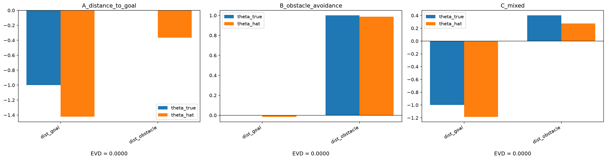

# Swim-IRL

**Inverse reinforcement learning** (IRL) on real trajectories of **active**
microscopic swimmers, to infer the reward function under which their
behavior is *as if* optimal.

## Motivation

Active microscopic swimmers — bacteria, migrating cells, nematodes — clearly
behave in a directed, purposeful way in response to chemical gradients, but
we rarely have direct access to "the" objective driving that behavior. IRL
offers a principled way to ask: what is the simplest reward function under
which the observed behavior is (quasi-)optimal? Swim-IRL builds that
pipeline from scratch, starting with a fully simulated, controlled testbed
before ever touching real data.

## Objective

> Find the simplest reward function under which the observed behavior is
> quasi-optimal, then test whether that reward is (a) interpretable,
> (b) predictive out-of-sample, (c) consistent with the known
> biochemical/neural mechanism.

This is **not** "discovering the animal's true reward." It is an explicit
*as-if* model. IRL is ill-posed — several different reward functions can
explain the same trajectories — and this project is meant to handle that
ambiguity, not hide it.

## Target organism

***C. elegans*** — chemotaxis. The literature already decomposes navigation
into two parallel mechanisms:
- **pirouette** (klinokinesis): sharp reorientations, triggered when the
  perceived concentration *drops* over time;
- **weathervane** (klinotaxis): gradual curving of the heading toward the
  gradient.

This is a good test case for IRL: biology has already proposed a two-channel
behavioral structure — IRL should either recover it from behavior alone, or
give a clear reason why it doesn't.

## Approach

- **Linear MaxEnt IRL** (Ziebart, Maas, Bagnell & Dey, AAAI 2008) first —
  prioritizing interpretability, over reward features that are isolable and
  testable one at a time. Validated on a small tabular gridworld before
  anything else (Phase 0a).
- **Deep MaxEnt IRL** (Wulfmeier, Ondruska & Posner, 2015 — see References)
  extends linear MaxEnt to a nonlinear (neural) reward, but keeps the same
  exact tabular DP — which doesn't scale to a continuous environment like
  NanoGoal-RL. So in practice it's implemented here as **Guided Cost
  Learning** (Finn, Levine & Abbeel, ICML 2016 — see References): the
  sampling-based descendant of the same idea, usable on continuous state.
  A reward network is trained via importance-sampled maximum-entropy IRL.
  Policy optimization is handed off to an existing RL library
  (Stable-Baselines3 / PPO), so the effort goes into the reward-learning
  loop itself, not into reimplementing policy gradients. The recovered
  reward here is **state-only** (r(s), consistent with AIRL's state-only
  design below) — a deliberate simplification, since NanoGoal-RL's actual
  reward includes a genuinely action-dependent term (a penalty on the
  raw `dv`/`dtheta` changes, to discourage spinning) that a state-only
  reward structurally cannot represent. The working hypothesis is that
  this term is minor relative to the state-dependent goal-distance and
  collision terms, so state-only recovery should still capture the
  dominant structure — untested until Phase 0b's results are in, and
  exactly the kind of gap Phase 3's mechanism-consistency comparison is
  meant to catch, not something assumed away.
- **AIRL** (Fu, Luo & Levine, 2018) via the `imitation` library
  (HumanCompatibleAI), for a more transferable, dynamics-independent
  reward over continuous state.
- Both continuous-state methods (Deep MaxEnt / AIRL) are validated on a
  second synthetic testbed before touching real data: the continuous,
  known-reward environment from
  [NanoGoal-RL v2](https://github.com/Josh012006/NanoGoal-RL/tree/v2),
  reused here as a controlled continuous-control sanity check, independent
  of the worm data (Phase 0b).
- Core difficulty: the worm's decisions are not observed directly, only its
  position/posture over time → heading, speed, and reorientation events
  (pirouette vs. weathervane) will need to be reconstructed from real
  trajectories before IRL can be run (Phase 2).

## References

Key papers this project builds on — read before implementing the
corresponding phase.

- [x] Ziebart, B. D., Maas, A., Bagnell, J. A., & Dey, A. K. (2008).
  *Maximum Entropy Inverse Reinforcement Learning*. AAAI.
  [PDF](https://cdn.aaai.org/AAAI/2008/AAAI08-227.pdf)
  Core method for Phase 0a — resolves the ambiguity of choosing among reward
  functions that equally explain the observed behavior, via the principle
  of maximum entropy.
- [x] Wulfmeier, M., Ondruska, P., & Posner, I. (2015). *Maximum Entropy
  Deep Inverse Reinforcement Learning*.
  [arXiv:1507.04888](https://arxiv.org/abs/1507.04888)
  Extends Ziebart 2008 to a nonlinear (neural) reward, still via exact
  tabular DP. Origin of the term "Deep MaxEnt IRL" used in this project —
  see the Finn et al. 2016 entry below for the continuous-state version
  actually implemented (Phase 0b, Phase 1).
- [x] Finn, C., Levine, S., & Abbeel, P. (2016). *Guided Cost Learning: Deep
  Inverse Optimal Control via Policy Optimization*. ICML.
  [arXiv:1603.00448](https://arxiv.org/abs/1603.00448)
  Sample-based descendant of Wulfmeier 2015, usable on continuous
  state/action spaces — this is what "Deep MaxEnt IRL" concretely means in
  this project (Phase 0b, Phase 1).
- [x] Fu, J., Luo, K., & Levine, S. (2018). *Learning Robust Rewards with
  Adversarial Inverse Reinforcement Learning*. ICLR.
  [arXiv:1710.11248](https://arxiv.org/abs/1710.11248)
  Planned extension (Phase 1+) — decouples the recovered reward from
  environment dynamics for better transfer across conditions, relevant to
  Phase 4.
- [x] Vergassola, M., Villermaux, E., & Shraiman, B. I. (2007). *'Infotaxis'
  as a strategy for searching without gradients*. Nature, 445(7126), 406–409.
  [Nature](https://www.nature.com/articles/nature05464) ·
  [free PDF](https://faculty.washington.edu/minster/bio_inspired_robotics/research_articles/vergassola_vellermaux_shraiman_infotaxis_searching_without_gradients_nature2007.pdf)
  Basis for the candidate "information" reward feature (Phase 1).
- [ ] Chen, K. S., Pillow, J. W., & Leifer, A. M. (2026). *State-switching
  navigation strategies in Caenorhabditis elegans are beneficial for
  chemotaxis*. PNAS, 123(25), e2519999123.
  [Free full text (PMC)](https://pmc.ncbi.nlm.nih.gov/articles/PMC12324552/) ·
  [arXiv preprint](https://arxiv.org/abs/2508.00191)
  Not a blog post — no popular write-up of this specific result was found,
  so this links the paper itself (free either way). Directly relevant to
  the Phase 1 action-space decision: argues the pirouette/weathervane
  split isn't two parallel per-timestep channels, but two persistent
  internal states the animal switches between, driven by sensory input.
  Read this one last, once Option A's own results are in hand.
- [x] Gleave, A., Taufeeque, M., Rocamonde, J., Jenner, E., Wang, S. H.,
  Toyer, S., Ernestus, M., Belrose, N., Emmons, S., & Russell, S. (2022).
  *imitation: Clean Imitation Learning Implementations*.
  [arXiv:2211.11972](https://arxiv.org/abs/2211.11972)
  Not a method to read before implementing, like the others above — the
  software library `irl/airl_wrapper.py` is built on
  (HumanCompatibleAI/imitation, verified against v1.0.1). Cited here for
  the same reason the papers are: the actual adversarial training loop in
  AIRL is this library's, not reimplemented in this project (unlike GCL).
  ```bibtex
  @misc{gleave2022imitation,
    author = {Gleave, Adam and Taufeeque, Mohammad and Rocamonde, Juan and Jenner, Erik and Wang, Steven H. and Toyer, Sam and Ernestus, Maximilian and Belrose, Nora and Emmons, Scott and Russell, Stuart},
    title = {imitation: Clean Imitation Learning Implementations},
    year = {2022},
    howPublished = {arXiv:2211.11972v1 [cs.LG]},
    archivePrefix = {arXiv},
    eprint = {2211.11972},
    primaryClass = {cs.LG},
    url = {https://arxiv.org/abs/2211.11972},
  }
  ```

## Roadmap (phases)

**Phase 0a — Tabular simulation validation (blocking).**
Build a small discretized/tabular simulated swimmer with a CHOSEN
ground-truth reward, verify that linear MaxEnt IRL recovers it, on ≥ 3
different test rewards.

**Phase 0b — Continuous simulation validation (blocking).**
Same validation, one level up in complexity: verify that Deep MaxEnt IRL
(Guided Cost Learning) and AIRL each recover a sensible reward on a
continuous-control environment with a known ground-truth reward, before
either method ever sees worm data. Testbed:
[NanoGoal-RL v2](https://github.com/Josh012006/NanoGoal-RL/tree/v2),
reused as an external, already-known-reward environment (not
reimplemented). Real data is off limits until **both** Phase 0a and Phase
0b are met.

**Phase 1 — State/action representation + features.**
Candidate state: local concentration, estimated local gradient, temporal
derivative of concentration, speed, heading. **Known gap**: none of these
carry memory beyond a single instant — see the memory diagnostic below
before finalizing this list.

Candidate features: concentration, velocity-gradient alignment, temporal
derivative (chemotaxis hypothesis), effort cost, information term
(infotaxis, Vergassola 2007 — see References). The information feature
must be the **prospective, action-conditioned** expected reduction in the
entropy of a Bayesian posterior over source location — not the
retrospective realized reduction — since the DP needs a value that varies
across candidate actions at the same state. Unlike the other four
features, this one requires standing up an actual belief-state filter,
not just a direct formula: budget for that separately. Whether it earns a
nonzero weight at all is an open empirical question, not a given —
infotaxis was developed for turbulent, sparse-cue search, and the NaCl
assay's gradient may be smooth enough that gradient-climbing features
already do all the work.

**Action space (resolved)**: unified action space — a single turning angle
discretized into $N$ bins ($N$ left symbolic, TBD once an empirical
criterion is chosen — not to be pinned to a specific value yet).
Deliberately doesn't encode the pirouette/weathervane split, so this phase
can test whether that structure emerges from behavior alone rather than
assuming it. The two-channel, biologically-structured action space
(continuous weathervane + discrete pirouette) is kept as a second,
explicit parameterization for comparison once Phase 0b's methods (Guided
Cost Learning / AIRL) are available — it isn't compatible with Phase 0a's
exact tabular DP without further discretization anyway.

**Memory diagnostic — do this before finalizing the state above.**
Order of operations, once real trajectories are available (Phase 2):
1. Compute the inter-turn-interval distribution from real trajectories;
   fit single vs. double exponential (as in Chen, Pillow & Leifer 2026 —
   see References).
2. Single exponential fits well → the memoryless candidate state above is
   fine as planned; proceed.
3. Double exponential fits better → augment the state with a short window
   of recent history (e.g. running turn-rate over the last few seconds, an
   EMA of dC/dt, time-since-last-turn) before running IRL. This stays
   inside the existing MaxEnt/GCL/AIRL machinery — just a wider state.
4. Only if the augmented state still can't reproduce the double-exponential
   signature in recovered/simulated behavior → escalate to an explicit
   latent-state (POMDP-style) extension. Treat this as a documented
   limitation/future-work item, not a default plan (see Limitations,
   Future work).

**Phase 2 — Real data.**
Load *C. elegans* trajectories in a gradient (NaCl or odorant). Cleaning,
interpolation, speed estimation, pirouette/weathervane segmentation.
Not allowed: passive (purely Brownian) particles → degenerate reward.

**Phase 3 — Comparison to the known mechanism.**
For the linear model: does the "temporal derivative" feature emerge as
dominant, consistent with what is known about the real sensory mechanism?
For Deep MaxEnt / AIRL, the reward is no longer a transparent linear sum,
so mechanism-consistency is tested via feature ablation / sensitivity
analysis instead of reading off a weight directly. This phase also
compares interpretability and mechanism-consistency across all three
recovered rewards (linear MaxEnt, Deep MaxEnt, AIRL).

**Phase 4 — Robustness & transfer.**
Does the inferred reward predict unseen trajectories, other individuals,
other gradient conditions?

## Progress

- [x] Phase 0a — tabular simulation validation
- [ ] Phase 0b — continuous simulation validation
- [ ] Phase 1 — state/action representation
- [ ] Phase 2 — real data
- [ ] Phase 3 — comparison to the known mechanism
- [ ] Phase 4 — robustness & transfer

*(Phase 0a implemented and validated; Phase 0b's GCL and AIRL are both
implemented, verified end-to-end against the real environment/models, and
the remote training pipeline (CI/CD + systemd) is set up — full-scale
runs not yet launched, no results to report yet)*

## Results

**Phase 0a — tabular recovery (done).** Linear MaxEnt IRL recovers a
behaviorally correct reward — Expected Value Difference (EVD) = 0 — on
all 3 ground-truth reward modes tested on the 6×6 gridworld: pure
goal-seeking, pure obstacle-avoidance, and a mixed reward (see
`experiments/phase0a_recovery.py` for the exact theta vectors, now over
just `dist_goal`/`dist_obstacle` — `row`/`col` were dropped, see
Limitations). Regenerate with:

```bash
python -m experiments.phase0a_recovery --seed 0
```



**What EVD = 0 does and doesn't establish.** EVD gives real confidence:
the recovered policy is behaviorally indistinguishable from the
truly-optimal one under the true reward, from any valid start state — not
a weak claim, and one that held up after real debugging (an optimizer
instability, and a feature-collinearity issue, both documented below).
But `theta_hat` itself doesn't fully converge to `theta_true` numerically
even once optimization has genuinely plateaued (see Limitations) — so
linear MaxEnt IRL, on this tabular setup, recovers *behavior* reliably
without recovering the *reward's individual weights* uniquely. That's the
ill-posedness this project names as a starting principle (see Objective),
now observed directly rather than assumed.

To be precise about what this does and doesn't motivate: GCL and AIRL
don't inherently fix feature collinearity — an underdetermined reward is
a property of what the demonstrated behavior can distinguish, not of the
algorithm recovering it, and a neural reward would face an analogous
issue if given comparably collinear data (and be harder to inspect while
facing it). What Phase 0b actually adds is two different, genuinely new
robustness checks Phase 0a's single fixed gridworld never ran: whether
the same pipeline holds up on a richer, continuous environment (NanoGoal-RL)
where features are less likely to be as tightly collinear as on a small
grid, and — specifically for AIRL — whether the recovered reward stays
valid under a *change in the environment's own dynamics*, a dynamics-
transfer robustness property Phase 0a's one fixed MDP was never in a
position to test at all.

**Phase 0b — infrastructure, algorithms, and training pipeline (ready
to run).** The NanoGoal-RL v2 submodule is integrated, `sim/nanogoal_adapter.py`
and `data/simulate_nanogoal.py` verified end-to-end against real held-out
seeds (`tests/test_nanogoal_integration.py`). `irl/gcl.py` and
`irl/airl_wrapper.py` are both fully implemented and verified with real
(small-scale) training runs against the real environment — not mocked
(`tests/test_gcl.py`, `tests/test_gcl_integration.py`,
`tests/test_airl_integration.py`). The complete remote training pipeline
(two independent GitHub Actions workflows + systemd-backed shell scripts,
one per algorithm, mirroring NanoGoal-RL's own CI/CD architecture) is set
up under `.github/workflows/train_phase0b_gcl.yml` and
`.github/workflows/train_phase0b_airl.yml`. TensorBoard logging is active
for both: GCL writes `gcl/reward_loss`, `gcl/background_success_rate`,
and `gcl/iteration` alongside PPO's own internal metrics (entropy,
value_loss, clip_fraction, etc.); AIRL writes PPO/imitation's own metrics.

To launch a training run: edit `.github/ci/train_phase0b_gcl.flag` (or
`train_phase0b_airl.flag`), set `train=true` and the desired cell flags
to `true`, then push. The workflow reads the flag, writes the systemd
environment file, and starts the service — which runs independently of
the GitHub Actions job, checkpoints every N iterations, and sends email
notifications at key milestones. Full-scale runs not yet launched; no
recovery results to report yet.


## Reproducibility

Every experiment must be rerunnable end-to-end from a single command with a
fixed seed. Figures and metrics are regenerated by that command, never
hand-edited. Some regenerated artifacts (e.g.
`experiments/results/phase0a_recovery.png`) are committed anyway, so they
render inline in this README — but they stay fully disposable: deleting
them and rerunning the experiment command recreates them exactly.

## Limitations

**Known from the start (principles, not empirical findings yet):**
- IRL is ill-posed: several reward functions can explain the same behavior.
  This project will never claim to have found *the* worm's reward, only *a*
  simple reward consistent with what is observed.
- The inferred reward is an *as-if* model, not a claim about what the
  worm's nervous system actually computes.
- The default state design is memoryless (Markovian in the instantaneous
  state). Real *C. elegans* navigation may involve a persistent internal
  state lasting several seconds (Chen, Pillow & Leifer 2026 — see
  References) that a memoryless model structurally cannot reproduce (e.g.
  the double-exponential inter-turn-interval statistic). See Phase 1's
  memory diagnostic for the planned mitigation before this becomes an
  empirical finding rather than a known risk.

**Documented as the project progressed:**
- Early versions of Phase 0a's features included `row`/`col` (raw grid
  position). With a single fixed start state, they ended up collinear
  with `dist_goal` along the one start→goal path actually demonstrated,
  and recovered theta values diverged substantially from ground truth on
  those two features even when EVD = 0. Randomizing the start
  distribution (now uniform over non-obstacle cells) helped but didn't
  fully resolve it — some of that collinearity is structural, from having
  a goal fixed in a grid corner, not just an artifact of limited start
  diversity. `row`/`col` were dropped entirely; they didn't correspond to
  anything in the real worm project anyway.
- Even with only `dist_goal`/`dist_obstacle` remaining, some correlation
  persists, and it's mode-dependent: strong (correlation ≈ -0.7) when the
  ground-truth reward is goal-seeking-dominant, negligible (≈ 0.01) under
  pure obstacle-avoidance. Recovered weight on `dist_obstacle` in
  goal-seeking-dominant modes stays meaningfully nonzero even when ground
  truth is exactly 0 — EVD still correctly reports 0 in these cases: the
  recovered *behavior* is optimal, even though the individual feature
  weight isn't uniquely pinned down by the data.
- More optimization iterations do not fix this, and can make theta_hat
  drift numerically further from theta_true rather than closer:
  log-likelihood plateaus (near-zero gains) well before 300 iterations,
  while theta_hat keeps slowly moving along the collinear direction with
  essentially no likelihood gain to show for it — a textbook flat-ridge
  optimization signature, not a sign of insufficient training.
- Separately, a genuine optimizer bug was found and fixed along the way:
  `learning_rate=0.1` made the (provably concave) MaxEnt log-likelihood
  decrease at some iterations instead of increasing monotonically —
  optimizer instability, not expected behavior for a concave objective.
  Fixed by lowering to `learning_rate=0.02`, and now covered by a
  regression test (`tests/test_convergence_diagnostic.py`, using
  `eval/convergence_diagnostic.py`) so a learning rate creeping back up
  gets caught automatically instead of silently producing a bad theta_hat.
- Phase 0b's recovered reward is state-only (`r(s)`), but NanoGoal-RL's
  actual reward has a genuinely action-dependent term (a penalty on
  `dv`/`dtheta` changes, discouraging spinning) that a state-only reward
  structurally cannot represent. Proceeding anyway on the working
  hypothesis that this term is minor relative to the state-dependent
  goal-distance/collision terms — see Approach for the reasoning; this is
  untested until real Phase 0b results are in.
- `gymnasium.wrappers.FlattenObservation` was deliberately NOT used for
  AIRL's observation flattening: verified it orders `Dict` observation
  keys alphabetically (`agent, delta_goal, lidar, mvt`), not the order
  `sim/nanogoal_adapter.py`'s own `flatten_observation` uses (`agent,
  mvt, delta_goal, lidar`), which GCL's reward network was built around.
  Using the built-in wrapper would have silently made AIRL's state
  representation inconsistent with GCL's, breaking any later Phase 3
  comparison between the two recovered rewards without an error anywhere
  to signal it. `irl/airl_wrapper.py`'s `FlattenedNanoGoalEnv` reuses
  `flatten_observation` directly instead, guaranteeing identical
  ordering between both methods.
- AIRL training uses `allow_variable_horizon=True` (required by
  NanoGoal-RL's inherently variable-length episodes). This carries a
  documented risk: episode length can itself encode reward-relevant
  information — demonstrations are all successes (shorter), while the
  generator's early rollouts often run to the truncation cap (longer),
  so the discriminator could learn "short = expert" as a shortcut
  instead of the real state-based reward structure. GCL has no
  equivalent built-in check surfacing the same risk but is not
  necessarily immune to it either. Both cases are documented here rather
  than silently accepted.
- The Phase 0b grid was reduced from 3×3 to 2×2 (dropping `hard` from
  both axes — `model_difficulty` and `seed_mode`) after `hard` training
  on the NanoGoal-RL side completed but did not converge to an optimal
  policy. Validating GCL/AIRL against demonstrations generated by a
  known-suboptimal expert would confound "is the recovered reward wrong"
  with "was the demonstrator itself already broken" — so `hard` was
  excluded entirely, not skipped-and-worked-around. `seed_mode`'s
  `mixed` tier (which included hard seeds) was dropped along with it
  rather than redefined, since a mix missing its hardest category isn't
  the same experimental condition as the one originally planned. The
  grid is now: `model_difficulty` ∈ {easy, medium}, `seed_mode` ∈
  {easy, easy_medium}.

## Technologies used

- Python
- NumPy / SciPy
- Gymnasium
- Stable-Baselines3 (PPO — the inner policy optimizer for Guided Cost
  Learning, and reused internally by `imitation`'s AIRL)
- `imitation`==1.0.1 (AIRL/GAIL — Gleave et al. 2022, see References)
- Matplotlib
- JAX (optional, for differentiable components)
- `trackpy` (optional, if starting from raw video)
- TensorFlow, PyGame, `wandb` (optional — only needed for Phase 0b,
  pulled in transitively through the NanoGoal-RL submodule)

## Installation

Tested to work identically on Windows, macOS, and Linux. Line endings are
normalized via `.gitattributes` to avoid CRLF/LF diff noise across
platforms.

```bash
git clone https://github.com/Josh012006/Swim-IRL.git
cd Swim-IRL
```

This repository uses [NanoGoal-RL](https://github.com/Josh012006/NanoGoal-RL)
(pinned to the `v2` branch) as a git submodule — it's the continuous
synthetic testbed for Phase 0b, not a runtime dependency of Phase 0a/1's
tabular work:

```bash
git submodule update --init --recursive
```

Create and activate a virtual environment:

**Windows (PowerShell):**
```powershell
python -m venv venv
venv\Scripts\Activate.ps1
```

**Windows (cmd.exe):**
```bat
python -m venv venv
venv\Scripts\activate.bat
```

**macOS / Linux:**
```bash
python3 -m venv venv
source venv/bin/activate
```

Then, on any OS:
```bash
pip install -r requirements.txt
```

Phase 0b additionally needs NanoGoal-RL's own dependencies (TensorFlow,
Stable-Baselines3, PyGame, `wandb`) — install them only if you're working
on that phase:
```bash
pip install -r external/NanoGoal-RL/requirements.txt
```

## Usage

```bash
python -m experiments.phase0a_recovery --seed 0
```

Runs Phase 0a's 3 reward-recovery modes end to end and regenerates
`experiments/results/phase0a_recovery.png` (see Results below).

```bash
python -m experiments.phase0b_gcl_training --seed 0 --quick --cell easy_easy
python -m experiments.phase0b_airl_training --seed 0 --quick --cell easy_easy
```

Smoke tests for one cell each — completes in minutes, confirms the full
pipeline runs end to end. Drop `--quick` and remove `--cell` for a real
run (all cells, real budgets). For unattended remote execution on a
self-hosted runner, set the flag file and push instead:

```bash
# Edit .github/ci/train_phase0b_gcl.flag:
# train=true
# train_easy_easy=true   ← set whichever cells you want
# then:
git add .github/ci/train_phase0b_gcl.flag && git commit -m "trigger GCL cell easy_easy" && git push
```

Monitor with:
```bash
sudo journalctl -u swim-irl-phase0b-gcl -f
tensorboard --logdir logs/tensorboard/phase0b_gcl
```

Run both as modules (`python -m ...`), not as direct scripts (`python
experiments/foo.py`) — same import-path reason as running tests via
`python -m pytest` rather than `python tests/foo.py` directly. Every
subsequent milestone will get its own command added here as it lands.

## Repository structure

```
Swim-IRL/
  README.md
  requirements.txt
  external/
    NanoGoal-RL/        # git submodule, pinned to v2 — continuous testbed (Phase 0b)
  sim/
    gridworld.py         # tabular simulated swimmer (Phase 0a), reused for Phase 2
    features_gridworld.py # Phase 0a-only toy features (dist-to-goal,
                          # dist-to-obstacle) — separate from features.py,
                          # which is reserved for the real worm features
    nanogoal_adapter.py  # NanoGoal-RL's env/policies as-is (Phase 0b) --
                         # create_env, load_test_seeds, load_policy,
                         # flatten_observation, rollout
  irl/
    maxent_linear.py     # Phase 0a
    gcl.py               # Guided Cost Learning (Phase 0b, Phase 1) --
                         # RewardNetwork, RewardWrappedEnv,
                         # compute_importance_weights, reward_loss,
                         # train_gcl -- verified against the real
                         # easy model/environment
    airl_wrapper.py       # AIRL via imitation (Phase 0b, Phase 1) --
                         # FlattenedNanoGoalEnv (NOT gymnasium's
                         # FlattenObservation, which orders Dict keys
                         # alphabetically -- inconsistent with GCL's own
                         # ordering, see Limitations), train_airl
  features.py             # isolable reward features
  mdp.py                   # shared TabularMDP dataclass + coord_to_state/
                            # state_to_coord — no dependencies, importable
                            # from sim/, irl/, data/, eval/ without
                            # circular/backward imports
  data/
    loaders.py            # loading + cleaning of real trajectories
    simulate.py            # ground-truth trajectory generation (Phase 0a)
    simulate_nanogoal.py    # 2x2 agent x environment-mix demonstration
                              # grid generation (Phase 0b) -- hard dropped,
                              # see Limitations
  eval/
    recovery.py            # reward recovery metrics (Phase 0a)
    recovery_continuous.py  # sampling-based analogue of EVD for Phase
                              # 0b -- no exact DP available in continuous
                              # state, so compares sampled true-reward
                              # returns instead (NOT guaranteed >= 0,
                              # unlike Phase 0a's EVD -- see file docstring)
    predictive.py           # out-of-sample prediction (Phase 4)
    memory_diagnostic.py     # inter-turn-interval single vs double
                              # exponential check (Phase 1/2, run before
                              # finalizing the state)
    convergence_diagnostic.py # MaxEnt log-likelihood monotonicity check
                              # -- catches optimizer instability
                              # (too-large learning_rate) separately from
                              # feature-identifiability issues (Phase 0a
                              # only -- GCL/AIRL have no concavity
                              # guarantee to check against)
  experiments/             # reproducible scripts, one per milestone
    phase0a_recovery.py      # Phase 0a: 3 reward modes, recovery + plot
    phase0b_gcl_training.py  # Phase 0b GCL: 2x2 grid, --cell/--quick/--n-envs
    phase0b_airl_training.py  # Phase 0b AIRL: same interface as GCL
    plotting.py              # shared plot helpers for Phase 0a reports
    plotting_phase0b.py       # shared plot helpers for Phase 0b reports
  tests/                   # at least the Phase 0a/0b tests
    conftest.py              # shared pytest fixtures (e.g. reference_mdp)
    test_maxent_linear.py     # irl/maxent_linear.py, vs. hand-derived values
    test_recovery.py          # eval/recovery.py
    test_simulate.py          # data/simulate.py
    test_convergence_diagnostic.py # eval/convergence_diagnostic.py
    test_nanogoal_integration.py # sim/nanogoal_adapter.py +
                              # data/simulate_nanogoal.py, against the
                              # real submodule/models
    test_gcl.py               # irl/gcl.py, pure shape/math checks
    test_gcl_integration.py    # irl/gcl.py's train_gcl, against real models
    test_airl_integration.py   # irl/airl_wrapper.py's train_airl + seed-mode
                              # wiring, against real models
  .github/
    workflows/
      tests.yml               # CI: runs pytest on every push (ubuntu-latest)
      train_phase0b_gcl.yml   # CI: reads train_phase0b_gcl.flag, launches
                              # systemd service on self-hosted runner
      train_phase0b_airl.yml  # CI: same for AIRL
    ci/
      train_phase0b_gcl.flag  # 5 fields: train + one per 2x2 cell (GCL)
                              # edit + push to trigger a training run
      train_phase0b_airl.flag # same for AIRL
      train_phase0b_gcl.sh    # systemd-backed script: runs cells sequentially,
                              # emails milestones, commits results, opens issue
      train_phase0b_airl.sh   # same for AIRL
```

## Future work

- Cross-species comparison
- IRL on molecular motors or regulatory networks
- Link between the inferred reward and a signaling pathway
- Modular/transferable reward
- Bridge toward encoding a policy in a molecular substrate
- Explicit latent-state (POMDP-style) extension of the IRL pipeline, if
  Phase 1's memory diagnostic shows that an augmented but still Markovian
  state isn't enough to reproduce real navigation statistics

## Author

Josué Mongan

## License

MIT License